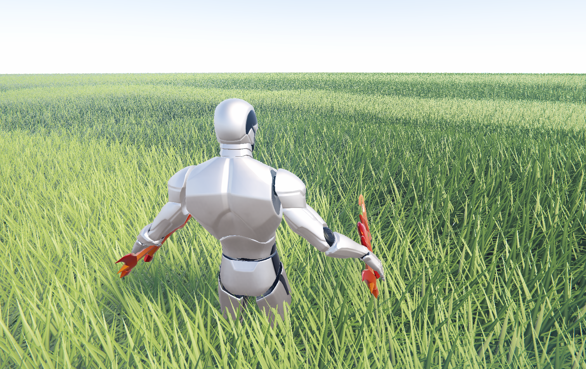
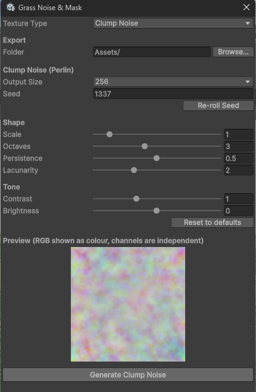
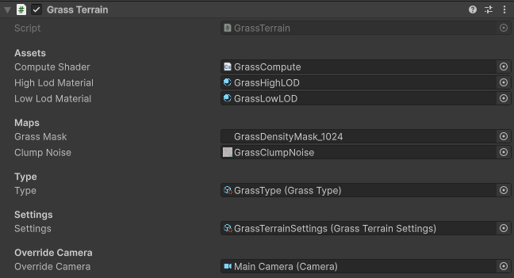
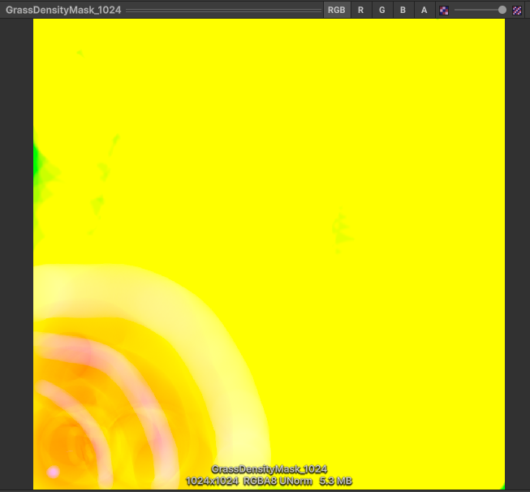
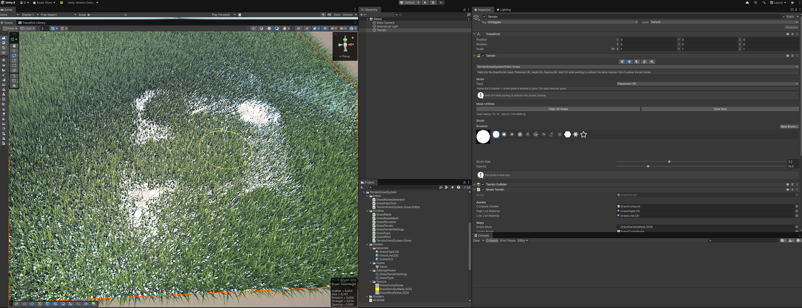

# 🌿 Terrain Grass System

**🌐 Язык / Language:** [English](README.md) · **Русский**

---

Оптимизированная процедурная трава для **Unity Terrain**.

Реализует подход из доклада *«Procedural Grass in Ghost of Tsushima»*:

- Травинки генерируются на GPU в compute-шейдере по кривой Безье.
- Мир делится на тайлы; видимые тайлы культируются на CPU (frustum + дистанция).
- Каждая травинка дополнительно отсеивается на GPU (frustum + max-distance).
- Runtime-генерация и отрисовка записываются в собственный **URP RenderGraph** pass после непрозрачной геометрии.
- Опциональный depth occlusion отбрасывает скрытую непрозрачными объектами траву до отрисовки.
- Два LOD-меша со стабильным стохастическим переключением — травинка не рисуется сразу в обоих LOD.
- Шум-куртины влияют на высоту, цвет и направление травы.
- Ветер — Perlin-текстура + per-blade фаза.
- До восьми источников взаимодействия могут отгибать траву и защищать игрока от depth occlusion.
- Изогнутые «фейковые» нормали и поворот к камере без дополнительной геометрии.
- Художники задают параметры через ScriptableObject `GrassType`.



---

## 📦 Установка (UPM)

Пакет лежит в подпапке `Assets/TerrainGrassSystem`, поэтому в git-URL указывается `?path=`.

Package Manager → **Add package from git URL…**:

```
https://github.com/DmcEx0/TerrainGrassSystem.git?path=/Assets/TerrainGrassSystem
```

или вручную в `Packages/manifest.json` проекта:

```json
"com.terraingrasssystem.grass": "https://github.com/DmcEx0/TerrainGrassSystem.git?path=/Assets/TerrainGrassSystem",
```

---

## 📋 Требования

| | |
|---|---|
| **Unity** | 6.x с URP 17.x (проверено на `6000.3.8f1`, URP `17.3.0`) |
| **Render pipeline** | URP с включённым RenderGraph. Compatibility Mode (Render Graph отключён) в runtime не поддерживается. |
| **GPU** | Shader Model 5.0+ (compute-шейдеры, indirect indexed draw, `StructuredBuffer` в vertex stage). |

---

## 📁 Состав модуля

```
TerrainGrassSystem/
├── Runtime/                            (asmdef: TerrainGrassSystem.Grass)
│   ├── GrassBlade.cs                   C#-зеркало HLSL-структур
│   ├── GrassType.cs                    ScriptableObject параметров травы
│   ├── GrassTerrainSettings.cs         ScriptableObject настроек тайлов/LOD
│   ├── GrassBladeMesh.cs               генерация unit-mesh для двух LOD
│   ├── GrassWind.cs                    компонент ветра
│   ├── GrassInteractionSource.cs       помечает трансформ как источник взаимодействия
│   ├── GrassInteractionManager.cs      реестр источников + globals для ShaderGraph
│   ├── GrassRenderPassFeature.cs       URP RenderGraph generate/draw passes
│   ├── GrassRenderer.cs                GPU-буферы, compute, indirect draw
│   └── GrassTerrain.cs                 компонент-обвязка для Unity Terrain
│
├── Shaders/
│   ├── GrassCommon.hlsl                структуры и хелперы (общие)
│   ├── GrassWind.hlsl                  семплинг ветра + нода GrassWind_Apply
│   ├── GrassInteraction.hlsl           отгибание от источников + нода GrassInteraction_Apply
│   ├── GrassCompute.compute            CSGenerate + CSBuildArgs
│   ├── GrassBlade.shader               URP HLSL-шейдер (рабочий по умолчанию)
│   └── GrassBladeGraph.hlsl            Custom Function ноды для ShaderGraph
│
└── Editor/                             (asmdef: TerrainGrassSystem.Grass.Editor)
    ├── GrassNoiseGenerator.cs          окно генерации шума и маски
    └── GrassPaintTool.cs               кисть «Paint Grass» для террейна
```

---

## 🚀 Быстрый старт: настройка сцены

### Шаг 1. Сгенерировать стартовые текстуры

Открыть окно генератора: **`Tools → GrassSystem → Noise & Mask Generator`**.



В окне есть выпадающий список **Texture Type** — от выбора зависит наполнение окна:

1. **Clump Noise** — бесшовный Perlin-шум для куртин (высота / цвет / направление). Настроить `Scale`, `Octaves`, `Persistence`, `Lacunarity`, тон и нажать **Generate Clump Noise**.
2. **Density Mask** — пустая маска плотности. Выбрать размер (рекомендуется 1024) и нажать **Generate Blank Density Mask**. По умолчанию маска пустая (R = 0): трава появляется только там, где закрашена.

Поле **Folder** + кнопка **Browse…** задают папку экспорта (всегда внутри `Assets/`). Сгенерированные текстуры импортируются с правильными настройками автоматически (без сжатия, linear, нужный wrap-mode).

### Шаг 2. Создать ассеты-конфиги

В окне Project: **ПКМ → Create → TerrainGrassSystem → Grass → …**

- **Grass Type** — ровно один на террейн (параметры внешнего вида травы).
- **Terrain Settings** — настройки тайлов / LOD / производительности.

### Шаг 3. Создать материал

- **ПКМ → Create → Material**, назвать, например, `M_Grass`.
- Назначить шейдер **`TerrainGrassSystem/Grass/Blade`**.
- *(Для ShaderGraph-варианта — см. раздел [ShaderGraph](#-вариант-с-shadergraph).)*

### Шаг 4. Добавить URP Renderer Feature

Открыть каждый ассет **Universal Renderer Data**, который используется камерой с травой. Нажать **Add Renderer Feature** и добавить **Grass Render Pass Feature**. Оставить событие **After Rendering Opaques**.

Также убедиться, что в URP выключен **Compatibility Mode (Render Graph disabled)**. Runtime-fallback через `LateUpdate` намеренно отсутствует: без этого Renderer Feature трава не рендерится в Play Mode и в билде.

### Шаг 5. Повесить компоненты на террейн

На GameObject с компонентом **`Terrain`** добавить **`TerrainGrassSystem → Grass → Grass Terrain`** и заполнить поля (см. [справку ниже](#grassterrain)):

| Поле | Что назначить |
|---|---|
| Compute Shader | `GrassCompute` |
| High Lod Material | `M_Grass` |
| Low Lod Material | `M_Grass` *(можно тот же)* |
| Grass Mask | сгенерированная маска |
| Clump Noise | сгенерированный Perlin-шум |
| Type | ассет `GrassType` |
| Settings | ассет `GrassTerrainSettings` |



### Шаг 6. Добавить ветер *(опционально)*

На любой GameObject в сцене добавить компонент **`TerrainGrassSystem → Grass → Grass Wind`** и назначить `Wind Noise` (тот же Perlin-шум или отдельный — главное бесшовный). Без этого компонента трава просто не качается.

### Шаг 7. Покрасить траву

Маска по умолчанию пустая, поэтому травы пока нет. В инспекторе террейна у `GrassTerrain` появляется кисть **«TerrainGrassSystem/Paint Grass»** в ряду кистей террейна. Выбрать её и красить (см. раздел [Покраска](#-покраска-маски)).

### Шаг 8. Play

Нажать **Play**. В runtime трава рендерится только через URP RenderGraph. Без запуска она по-прежнему видна через исходный `[ExecuteAlways]` / `LateUpdate` preview для Scene View; этот путь editor-only и не попадает в player build.

---

## 🧩 Справка по компонентам

### GrassTerrain

Главный компонент. Вешается на объект с `Terrain`, связывает ассеты и передаёт данные текущего кадра камеры в RenderGraph pass.

| Поле | Тип | Описание |
|---|---|---|
| **Compute Shader** | ComputeShader | Шейдер генерации — ассет `GrassCompute`. |
| **High Lod Material** | Material | Материал на шейдере `TerrainGrassSystem/Grass/Blade` для ближнего LOD. |
| **Low Lod Material** | Material | Материал для дальнего LOD. Может быть тем же, что и High — отдельный позволяет тюнить отдельно. |
| **Grass Mask** | Texture2D | RGBA-маска, рисуется кистью Paint Grass. R = размещение/плотность, G = множитель высоты, B = clamp/пучкование, A = резерв. *(см. [Маска](#-маска-террейна-grass-mask))* |
| **Clump Noise** | Texture2D | Бесшовный Perlin-шум. Задаёт куртины: вариацию высоты, цвета и направления травы. **Обязателен** — без него трава не рендерится, хотя на *размещение* он не влияет. |
| **Type** | GrassType | Один тип травы на весь террейн. Локальные вариации задаются маской и шумом. |
| **Settings** | GrassTerrainSettings | Настройки тайлов, LOD, дистанций, ёмкости буферов. |
| **Override Camera** | Camera | *(только Play-mode)* Камера для расчёта LOD/culling вместо `Camera.main`. В Edit-mode всегда побеждает Scene View-камера. |

---

### GrassWind

Источник ветра. Один на сцену; рендереры находят его автоматически (`FindFirstObjectByType`). Работает и в Edit-mode.

| Поле | Тип | По умолч. | Описание |
|---|---|---|---|
| **Wind Noise** | Texture2D | — | Бесшовный Perlin-шум. R — основной порыв, G — вторая октава. |
| **Strength** | float ≥ 0 | `0.15` | Сила ветра (амплитуда наклона травинок). |
| **Frequency** | float | `0.06` | Мировая частота семплинга шума. Меньше = более крупные «волны» порывов. |
| **Scroll Speed** | float | `0.6` | Скорость прокрутки основной октавы шума. |
| **Gust Speed** | float | `0.9` | Скорость прокрутки второй октавы. Несовпадение с основной делает ветер «живым». |
| **Direction Degrees** | 0..360 | `45` | Направление ветра в градусах (в плоскости XZ). |

---

### GrassType

Параметры внешнего вида травы. Один ассет на весь террейн; разнообразие даёт маска + clump-шум.

#### Height (высота)

| Поле | По умолч. | Описание |
|---|---|---|
| **Base Height** | `0.8` | Базовая высота травинки, м. |
| **Height Variance** | `0.4` | Вариация высоты по **clump-шуму** — соседи меняются вместе, образуя видимые пятна высокой/низкой травы. |
| **Height Randomness** | `0.2` | Случайный разброс высоты **per-blade**, м. Независим от шума: каждая травинка тянет свой ролл. |

#### Width (ширина)

| Поле | По умолч. | Описание |
|---|---|---|
| **Base Width** | `0.04` | Базовая ширина у корня, м. |
| **Width Variance** | `0.02` | Случайный разброс ширины. |
| **Width Height Coupling** | `0.581` (0..1) | Насколько ширина масштабируется от высоты травинки. 0 = ширина независима; 1 = низкая травинка становится пропорционально тоньше. |

#### Shape (форма)

| Поле | По умолч. | Описание |
|---|---|---|
| **Base Tilt** | `-0.4` | Наклон вершины вперёд, радианы. |
| **Tilt Variance** | `0.1` | Случайный разброс наклона. |
| **Slope Follow** | `0` (0..1) | Насколько травинка повторяет наклон рельефа. 0 = всегда строго вверх; 1 = перпендикулярно поверхности. |
| **Facing Variance** | `3` | Ограниченный случайный поворот вокруг вертикали в радианах поверх выбранного базового направления. |
| **Facing Randomness** | `0.05` (0..1) | Бленд направления между clump-шумом и полностью случайным per-blade углом. 0 = следуют шуму; 1 = шум игнорируется. |
| **Bend** | `0` | Прогиб средней контрольной точки Безье (кривизна). Положительный — арка вперёд. |

#### Density (плотность)

| Поле | По умолч. | Описание |
|---|---|---|
| **Density Multiplier** | `1.0` (0..4) | Глобальный множитель плотности (домножается на `mask.r`). |
| **Max Blades Per Cell** | `16` (1..16) | Максимум травинок в ячейке при полностью закрашенном канале B (Clamp). При B=0 — базовые 1–2; при B=1 счётчик растёт к этому максимуму. ⚠️ Нагрузка на буферы растёт линейно — поднимать `MaxHighLodBlades` / `MaxLowLodBlades` синхронно. |

#### Short-blade optimizations (оптимизация коротких травинок)

| Поле | По умолч. | Описание |
|---|---|---|
| **Fold Height** | `0` | Травинки короче этого (м) рендерятся как **один меш, сложенный в V** — одна инстанция = две короткие суб-травинки. `0` = выключить. При включении обычно 30–50% от Base Height. |
| **Small Blade Height** | `0.1` | Несложенные травинки короче этого (м) уходят на low-LOD меш (1 треугольник вместо ~7). Сложенные не трогаются. `0` = выключить. |

#### Wind (ветер)

| Поле | По умолч. | Описание |
|---|---|---|
| **Wind Height Falloff** | `0.75` (0..1) | Ослабляет ветер для коротких травинок. При 1 sway примерно масштабируется квадратом относительной высоты; при 0 все высоты получают одинаковую базовую амплитуду. |

#### Color (цвет)

| Поле | Описание |
|---|---|
| **Base Color** | Цвет у корня. |
| **Tip Color** | Цвет у вершины. Между ними linear-градиент + ещё один lerp по clump-шуму (канал G). |

---

### GrassTerrainSettings

Настройки производительности и раскладки. Можно шарить между несколькими террейнами.

#### Tile Layout

| Поле | По умолч. | Описание |
|---|---|---|
| **Tile Size** | `10` (≥2) | Размер тайла в метрах. Меньше = точнее culling, но больше CPU-проверок и дескрипторов тайлов. |
| **Blades Per Tile Axis** | `135` (4..256) | Ячеек-кандидатов по оси тайла. До маски, плотности и GPU-culling всего N×N кандидатов. |

#### Culling

| Поле | По умолч. | Описание |
|---|---|---|
| **Tile Cull Distance** | `130` (≥2) | Тайлы дальше этой дистанции не загружаются и не генерируются. |
| **Max Blade Distance** | `150` (≥2) | Per-blade максимум: более дальние кандидаты отбрасываются на GPU. |
| **Frustum Padding Degrees** | `8` (0..20) | Расширяет culling-frustum и убирает голые полосы по краям при быстром повороте камеры. |
| **Enable Depth Occlusion** | `false` | Использует текущую opaque depth камеры и отбрасывает скрытые травинки до записи в draw-буферы. |
| **Depth Occlusion Bias** | `0.25` (≥0) | Защитный отступ в мировых метрах. Увеличить, если трава лопается на depth-границах. |
| **Depth Occlusion Radius Scale** | `0.8` (0..2) | Масштаб сферы травинки для depth-теста. Меньше = агрессивнее culling. |
| **Depth Occlusion Sample Radius Pixels** | `2` (0..4) | Радиус cross-samples вокруг центра травинки. Больше семплов безопаснее для краёв силуэта. |

#### LOD

| Поле | По умолч. | Описание |
|---|---|---|
| **High Lod Distance** | `4.1` (≥0) | Центр переключения между high-LOD мешем (4 сегмента) и low-LOD мешем (1 треугольник). |
| **Lod Blend Band** | `8` (≥0.1) | Ширина стабильного стохастического перехода и fade у max-distance. Каждая травинка попадает только в один LOD. |

#### Distance Thinning (прореживание по дистанции)

| Поле | По умолч. | Описание |
|---|---|---|
| **Thinning Start Distance** | `30` (≥0) | С этой дистанции трава начинает редеть. Ближе — не прореживается; high-LOD не трогается никогда. |
| **Thinning Strength** | `1` (0..1) | Насколько агрессивно редеет к max-distance. 0 = нет; 1 = максимум (почти все дальние low-LOD травинки выпадают). |

#### Clumping noise

| Поле | По умолч. | Описание |
|---|---|---|
| **Clump Scale** | `0` | Мировой масштаб clump-шума. Меньше = более крупные куртины; `0` семплирует одну постоянную точку. |

#### Buffer Capacity

| Поле | По умолч. | Описание |
|---|---|---|
| **Max High Lod Blades** | `600 000` (≥1024) | Потолок high-LOD буфера на кадр (по всем тайлам). Переполнение → травинки теряются. |
| **Max Low Lod Blades** | `800 000` (≥1024) | То же для low-LOD. |

---

## 🔄 Как runtime-рендер работает через RenderGraph

`GrassRenderPassFeature` добавляет после непрозрачной геометрии два упорядоченных pass:

1. **Generate pass.** CPU собирает видимые тайлы террейна и загружает их дескрипторы. Один batched compute-dispatch семплирует heightmap, маску и шум, отбрасывает кандидатов по дистанции/frustum и опционально по depth камеры, выбирает один LOD и записывает выжившие травинки в high/low GPU-буферы. Маленький compute-kernel строит indirect draw arguments прямо из GPU-счётчиков — readback на CPU отсутствует.
2. **Draw pass.** RenderGraph подключает текущие color/depth targets камеры и записывает по одному indirect forward draw на каждый LOD.

Это лучше вызова из `LateUpdate` в runtime: работа относится к конкретному кадру конкретной камеры, выполняется после появления opaque depth, а зависимости color/depth явно известны RenderGraph. Так становится возможен depth occlusion, и трава не отправляется случайно в лишние камеры вне render pipeline. Исходный путь `LateUpdate` + `Graphics.RenderMeshIndirect` сохранён только для Edit-mode preview в Scene View и вырезается из player build.

---

## 🎨 Маска террейна (`Grass Mask`)

RGBA-текстура размером с террейн (или меньше — растягивается по UV). Каналы:

| Канал | Назначение |
|---|---|
| **R** | **Размещение / плотность** (0..1). 0 — травы нет; >0 — растёт. Единственный обязательный канал для базовой травы. |
| **G** | **Множитель высоты** (0..1). 1 — полная высота из `GrassType`; 0 — минимальная высота короткой травинки. Если итоговая высота ниже ненулевого `Fold Height`, используется folded-blade оптимизация. Для удаления травы нужно красить R, а не G. |
| **B** | **Clamp / пучкование** (0..1). ОПЦИОНАЛЬНО. Где закрашен — растёт число травинок из одной точки + небольшой буст высоты (+25%) и яркости (+20%) на максимуме. Среднее число травинок на ячейку: B=0 → 1–2 (база), B=1 → к `Max Blades Per Cell`. |
| **A** | Зарезервирован. |



**Folded blade** — когда итоговая высота травинки опускается ниже `GrassType.FoldHeight`, compute эмитит одну «сложенную пополам» травинку. Шейдер (`ApplyBladeFold` в `GrassCommon.hlsl`) изгибает меш в точке `v=0.5` — получается V-образная фигура: середина меша становится корнем, а оба конца — вершинами двух коротких суб-травинок. Одна инстанция = две видимые травинки «бесплатно». `FoldHeight = 0` выключает оптимизацию.

---

## 🖌 Покраска маски

Рисовать удобнее всего прямо из инспектора террейна. У `GrassTerrain` в ряду кистей террейна появляется **«TerrainGrassSystem/Paint Grass»**.



**Режимы (Mode):**

| Режим | Канал | Что делает |
|---|---|---|
| **Placement (R)** | R | Где растёт трава. Базовый режим, единственный нужный для дефолта. |
| **Height (G)** | G | Локально варьировать высоту травы (0 = нет, 1 = полная). |
| **Spacing / Clamp (B)** | B | Пучкование: где закрашено — пучки из нескольких травинок с одного корня. |

**Управление:**

- Зажатый **Ctrl** во время рисования — вычитает значение того же канала (Ctrl + Placement = убрать траву, и т.д.).
- **Ctrl + Z** / **Ctrl + Shift + Z** (или **Ctrl + Y**) — undo / redo, пока активна кисть. История in-memory, живёт до domain reload, до 16 штрихов.

**Mask Utilities:**

- **Clear All Grass** — обнулить весь канал размещения.
- **Save Now** — принудительно сохранить PNG маски (иначе сохраняется отложенно после штриха).

---

## ⚙️ Окно «Noise & Mask Generator»

**`Tools → GrassSystem → Noise & Mask Generator`**

Поле **Texture Type** переключает наполнение окна между двумя генераторами:

### Clump Noise (Perlin)

| Параметр | Описание |
|---|---|
| **Output Size** | Размер текстуры (64…4096). |
| **Seed** | Зерно. Кнопка **Re-roll Seed** даёт новый паттерн при тех же настройках. |
| **Scale** | Плотность фич: больше = мельче паттерн. |
| **Octaves** | Число слоёв fBm. Больше = богаче/«шумнее». |
| **Persistence** | Громкость каждого следующего слоя. Низкая = гладко, высокая = шумно. |
| **Lacunarity** | Рост частоты на слой. 2 = стандартный fBm. |
| **Contrast** | Резкость переходов свет/тень. 1 = нейтрально, 0 = плоско, >1 = жёстко. |
| **Brightness** | Сдвиг яркости после контраста. |

Внизу — **живой превью** и кнопка **Generate Clump Noise**.

### Density Mask

| Параметр | Описание |
|---|---|
| **Size** | Размер маски (рекомендуется 1024). |

Кнопка **Generate Blank Density Mask** создаёт пустую маску (R=0 → травы нет, пока она не закрашена).

**Export Folder** (общее для обоих типов) — папка внутри `Assets/`, куда сохраняется PNG. Кнопка **Browse…** открывает выбор папки сразу в `Assets` текущего проекта.

---

## 🚄 Производительность

Профилировать нужно на целевом железе: цена сильно зависит от покрытия маски, разрешения экрана, высоты травинок и depth complexity. Рендерер уже объединяет все видимые тайлы в один compute-dispatch, выполняет дешёвый culling до семплинга height/noise, строит draw arguments на GPU и не читает число травинок обратно на CPU.

**Тюнинг (по убыванию эффекта):**

1. `Max Blade Distance` ↓
2. `Blades Per Tile Axis` ↓
3. `Thinning Strength` ↑ и/или `Thinning Start Distance` ↓
4. `Tile Cull Distance` ↓
5. Включить `Depth Occlusion`, если крупные непрозрачные объекты закрывают много травы
6. Уменьшить `Base Height`, `Max Blades Per Cell` и площадь плотно закрашенного Clamp (B), чтобы снизить overdraw и нагрузку на буферы

Для мобильных начать с `Blades Per Tile Axis = 48–64` и `Max Blade Distance = 25–40`, затем измерить. Ёмкости буферов стоит держать близко к реально нужному максимуму: capacity резервирует GPU-память, а стоимость draw определяется числом выживших травинок.

---

## 🛠 Troubleshooting

**Трава вообще не рендерится**
- Добавить `Grass Render Pass Feature` в активный Universal Renderer Data и оставить RenderGraph включённым. Runtime-fallback через `LateUpdate` отсутствует.
- В `GrassTerrain` обязательны: Compute Shader, оба материала, маска, шум, Type, Settings. Если хоть одно поле пустое — компонент молча скипает кадр.
- Маска пустая по умолчанию — **покрасить траву** кистью Placement.
- `Camera.main` не найдена → назначить `Override Camera` или поставить тег MainCamera.

**Трава мерцает / пропадает на расстоянии**
- `Lod Blend Band` слишком мал относительно `High Lod Distance` / `Max Blade Distance`. Поднять до 4–8 м.
- Переполняется `Max High Lod Blades` / `Max Low Lod Blades` — проверить в RenderDoc или поднять потолок.

**Трава «лежит» на одной высоте, игнорируя рельеф**
- Compute читает `terrain.terrainData.heightmapTexture`. Убедиться, что Terrain не смещён нестандартным Transform и `terrain.transform.position` совпадает с используемым origin.

**Ветер не двигается в Scene View**
- `GrassWind` в Edit-mode использует `EditorApplication.timeSinceStartup`. Если статично — проверить, есть ли в сцене активный объект с `GrassWind` и не отключён ли его GameObject.

**После переключения LOD травинки «лопаются»**
- Слишком резкий `Lod Blend Band`. Увеличить (~1/3 от `High Lod Distance`).

**Сильный overdraw / падает FPS**
- См. раздел [Производительность](#-производительность). Главные виновники — `Max Blade Distance` и `Blades Per Tile Axis`.

**Тени от травы отсутствуют**
- Forward-pass RenderGraph получает освещение URP и уже существующие тени сцены, но процедурная трава сейчас не отправляется в shadow maps URP. Чтобы трава отбрасывала тени, нужен отдельный shadow-caster Renderer Feature.

---

## 🧪 Вариант с ShaderGraph

Логика травы намеренно разбита на две Custom Function ноды, чтобы геометрию и ветер можно было подключать, менять и отключать независимо:

| Нода | Файл | Имя функции | Роль |
|---|---|---|---|
| **GrassBlade_Vertex** | `GrassBladeGraph.hlsl` | `GrassBlade_Vertex` | Геометрия травинки — позиция (без ветра), нормаль, цвет |
| **GrassWind_Apply** | `GrassWind.hlsl` | `GrassWind_Apply` | Смещение от ветра — горизонтальное покачивание |
| *(опц.)* **GrassBlade_Masks** | `GrassBladeGraph.hlsl` | `GrassBlade_Masks` | Отдельно AO + маска кончика |

Для графа LowLOD вместо `GrassBlade_Vertex` используйте `GrassBlade_VertexBillboard` — выходы и подключения идентичны.

### Пошаговая инструкция

1. **Create → Shader Graph → URP → Lit Shader Graph**, имя `GrassBlade`.
2. **Graph Inspector → Graph Settings:** Material = Lit, Surface Type = Opaque, Render Face = Both.
3. **Properties (exposed, Float):**

   | Property | Значение |
   |---|---|
   | `_CamFacingThreshold` | `0.8` (edge-on cos threshold) |
   | `_CamFacingMaxAngle` | `8.0` (макс. угол твиста на вершине, °) |
   | `_CurvedNormalAmount` | `0.7` |
   | `_AOStrength` | `0.5` |
   | `_TipBoost` | `1.2` |
   | `_Smoothness` | `0.05` |

4. **Нода 1 — GrassBlade_Vertex (геометрия):**
   Custom Function → Mode = File, Source = `GrassBladeGraph.hlsl`, Name = `GrassBlade_Vertex`.
   - **Inputs:** `PositionOS` (Vector3), `InstanceID` (Float), `CamFacingT` (Float), `CamFacingMaxA` (Float), `CurvedNAmt` (Float), `AOStrength` (Float), `TipBoost` (Float)
   - **Outputs:** `PositionWS` (Vector3), `NormalWS` (Vector3), `ColorBase` (Vector3), `UV` (Vector2), `WindBase` (Float)

5. **Нода 2 — GrassWind_Apply (ветер):**
   Custom Function → Mode = File, Source = `GrassWind.hlsl`, Name = `GrassWind_Apply`.
   - **Inputs:** `WindBase` (Float), `V` (Float)
   - **Outputs:** `WindOffset` (Vector3)

6. **Подключения:**

   ```
   Position (Object Space) ──────────────────────────────────────► PositionOS
   Split(Position OS).G    ──────────────────────────────────────► V  (нода ветра)
   Instance ID             ──────────────────────────────────────► InstanceID
   Property-ноды           ──────────────────────────────────────► соответствующие входы

   GrassBlade_Vertex.WindBase ────────────────────────────────────► WindBase (нода ветра)

   GrassBlade_Vertex.PositionWS ──┐
                                  ├─ Add ──────────────────────────► Vertex Position
   GrassWind_Apply.WindOffset   ──┘

   GrassBlade_Vertex.NormalWS  ───────────────────────────────────► Vertex Normal
   GrassBlade_Vertex.ColorBase ───────────────────────────────────► Base Color
   _Smoothness                 ───────────────────────────────────► Smoothness
   ```

   > Процедурный indirect draw использует единичную model-матрицу, поэтому Object Space ≡ World Space — Transform-нода не нужна.

   > **Отключить ветер:** не добавляйте ноду GrassWind_Apply, а `PositionWS` подключайте напрямую в Vertex Position.

7. **(опц.) Нода 3 — GrassBlade_Masks** — отдельные выходы AO и маски кончиков вместо пред-смешанного `ColorBase`.
   - **Inputs:** `V` (Float, из Split по Position(OS).G), `AOStrength` (Float)
   - **Outputs:** `AO` (Float), `TipMask` (Float)

   Типичная разводка цвета с этой нодой:

   ```
   GrassType_Color ─┐
                    ├─ Lerp ──┐
   TipColor ────────┘ T:TipMask ├─ Multiply ──┐
                                │             ├─ Multiply ── Base Color
                           AO ──┘             │
                                     GrassTint ┘  (Color property)
   ```

   При этой схеме **не** подключайте `ColorBase` из Ноды 1 в Base Color — иначе AO/TipBoost умножатся дважды.

8. Создать Material из графа, назначить в `GrassTerrain`. После проверки `GrassBlade.shader` можно удалить.

ShaderGraph может сгенерировать ShadowCaster/DepthOnly passes, но текущий Renderer Feature записывает только forward pass. Сам по себе сгенерированный ShadowCaster не заставляет процедурную траву попадать в shadow maps URP.

---

## 🌾 Интерактивная трава (источники)

Трава отгибается от явно зарегистрированных движущихся трансформов — игрока, кубов, капсул и т.п. Unity Collider не требуется.

### Настройка сцены

1. **Добавьте `GrassInteractionSource`** на каждый объект, который должен отгибать траву. Дефолтный HLSL-путь читает эти источники напрямую во время RenderGraph-генерации; компонент-менеджер ему не нужен. Обрабатывается до **8 источников**.
2. Поставьте **Radius** по примерному размеру объекта:

   | Тип объекта | Рекомендованный Radius |
   |---|---|
   | Капсула игрока (r=0.3 м) | `0.5` |
   | Маленький куб (1×1 м) | `0.7` |
   | Крупный враг | `1.0–1.5` |

3. Оставьте **Exclude From Depth Occlusion** включённым для игрока. Защитная сфера не даёт depth игрока вырезать дыру в траве за персонажем:

   | Поле | Назначение |
   |---|---|
   | **Depth Occlusion Center** | Центр защитной сферы в local space, обычно около корпуса. |
   | **Depth Occlusion Radius** | Радиус защиты; `0` переиспользует interaction Radius. |

   Для объектов, которые действительно должны закрывать траву, выключите опцию. Чтобы только защитить объект без отгибания травы, задайте `Radius = 0` и положительный `Depth Occlusion Radius`.

4. **Настройте `Interaction Strength`** (`_InteractionMaxPush`) на материале травы — максимальное смещение кончика в центре источника. По умолчанию: `0.5 м`.

Явные источники не требуют physics overlap-запросов каждый кадр, поэтому они дешевле и точнее, чем поиск объектов игрока через `LayerMask`.

### Подключение в ShaderGraph (при использовании GrassBladeGraph.hlsl)

При использовании interaction-ноды ShaderGraph добавьте в сцену один `GrassInteractionManager`. Он публикует зарегистрированные источники в global shader values; дефолтному HLSL-шейдеру менеджер не нужен.

Добавьте **третью** Custom Function ноду: Mode = File, Source = `GrassInteraction.hlsl`, Name = `GrassInteraction_Apply`.

| | |
|---|---|
| **Inputs** | `BladeRootWS` (Vector3) — новый выход `BladeRootWS` ноды `GrassBlade_Vertex` |
| | `V` (Float) — Split(Position OS).G, та же нода что и для ветра |
| | `MaxPush` (Float) — exposed property, по умолчанию `0.5` |
| **Output** | `InteractionOffset` (Vector3) |

Итоговая разводка позиции вершины:

```
GrassBlade_Vertex.PositionWS ──┐
                               ├─ Add ──┐
GrassWind_Apply.WindOffset   ──┘        ├─ Add ──► Vertex Position
GrassInteraction_Apply.InteractionOffset┘
```

Чтобы отключить интерактивность: удалите ноду и уберите второй Add.

---

## 🔌 Расширение

**Streaming больших миров (несколько террейнов):**
- `GrassRenderer` — один на террейн. Если мир делится на 10×10 terrain-тайлов → ставить `GrassTerrain` на каждый, они не мешают друг другу.

**Другой формат маски / источник density:**
- В `GrassCompute.compute` править `SampleGrassMask` и переинтерпретацию каналов в `CSGenerate` (placement / heightMul / densityMul).
